# Gift Bot - Telegram Mini App

Gift Bot is a Telegram mini app that allows users to buy and send gifts to their friends.
It is developed using [Nuxt.js](https://nuxtjs.org) and [Tailwind CSS](https://tailwindcss.com) for the purpose of the Crypto Bot contest.

Notable features include:
- 🎨 Native Telegram theme: the app adapts to the theme variables injected by Telegram
- 🌐 i18n: the app detects the user's preferred language from the Telegram app (supports English and Russian).
- 📱 Responsive design: the app is optimized for mobile devices.

## Screenshots

|  | |  |  |
|:-----:|:-----:|:-----------:|:-------:|
| 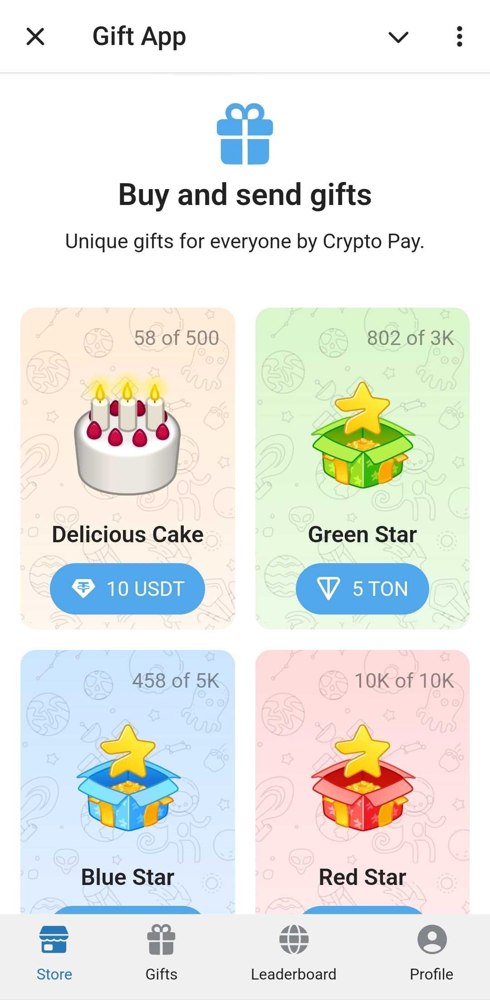 | 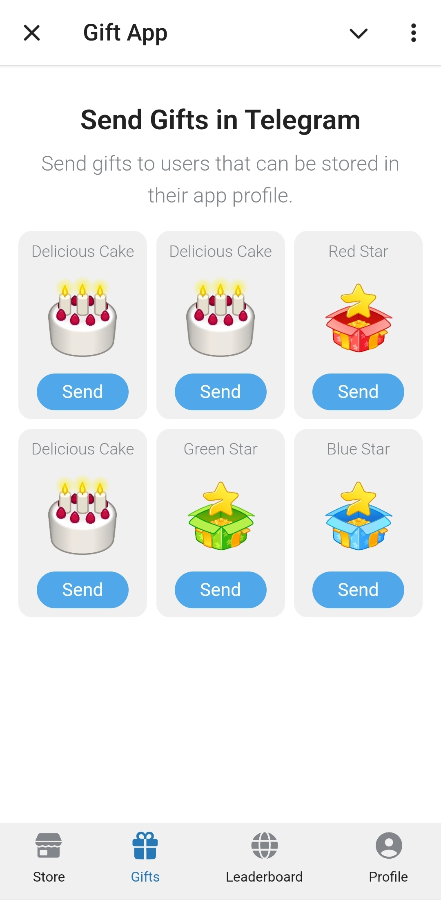 | 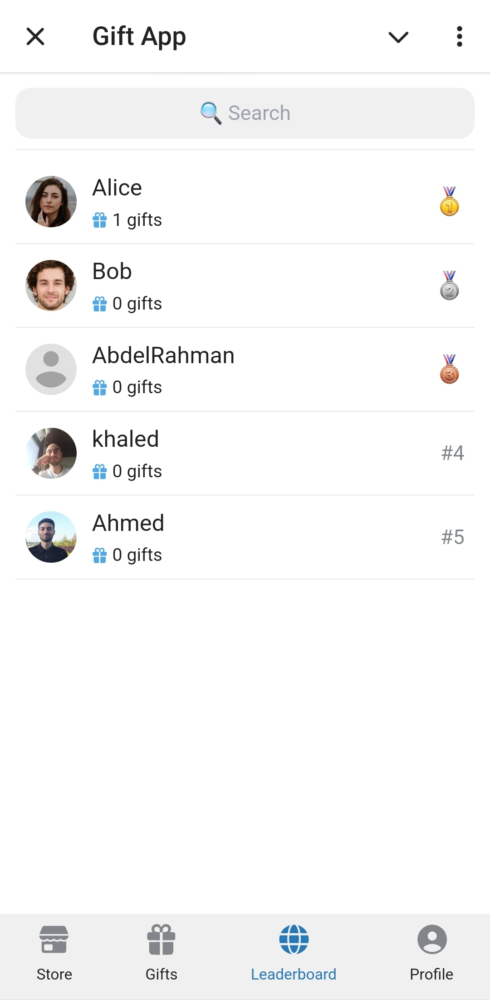 | 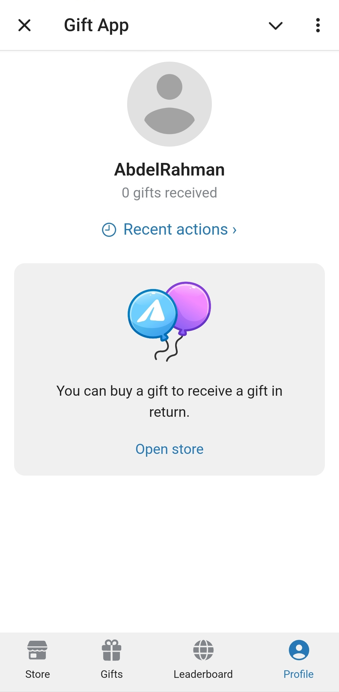 |
| 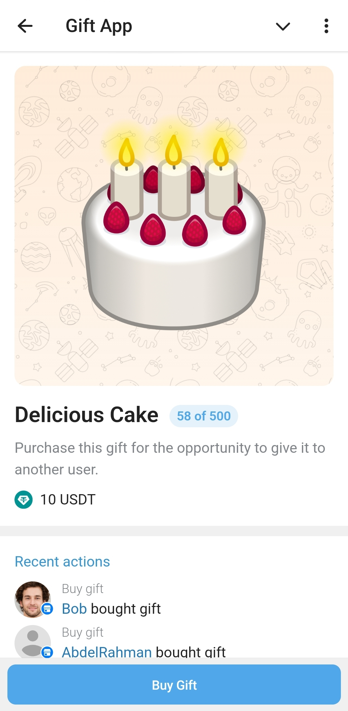 | 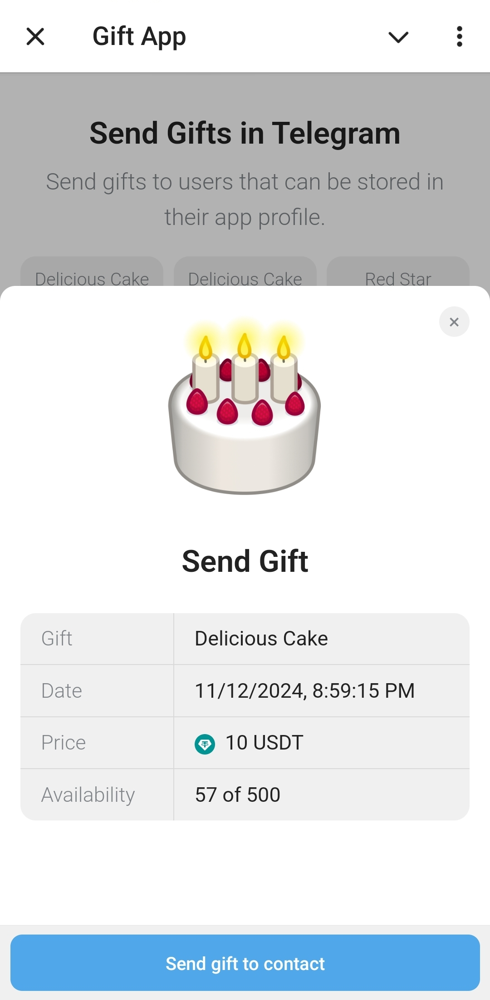 | 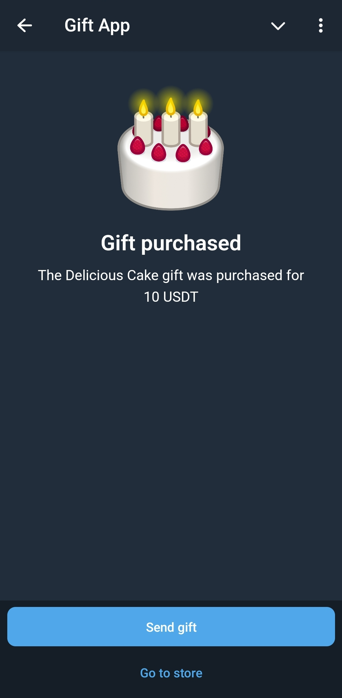 | 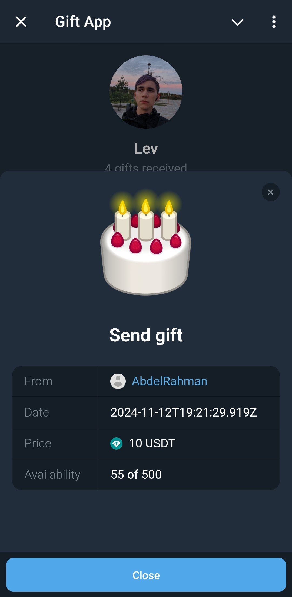 |
| 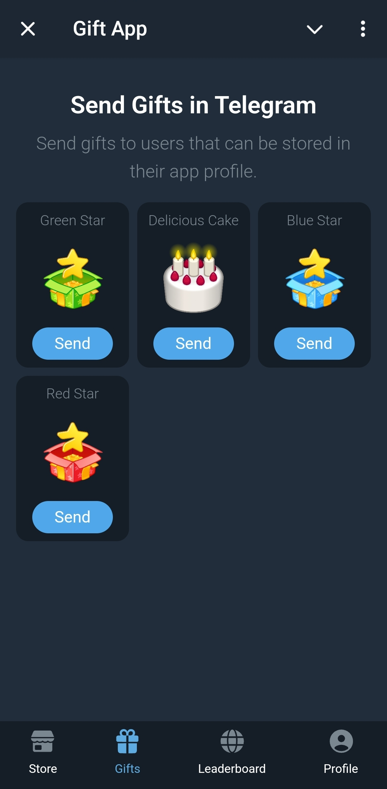 | 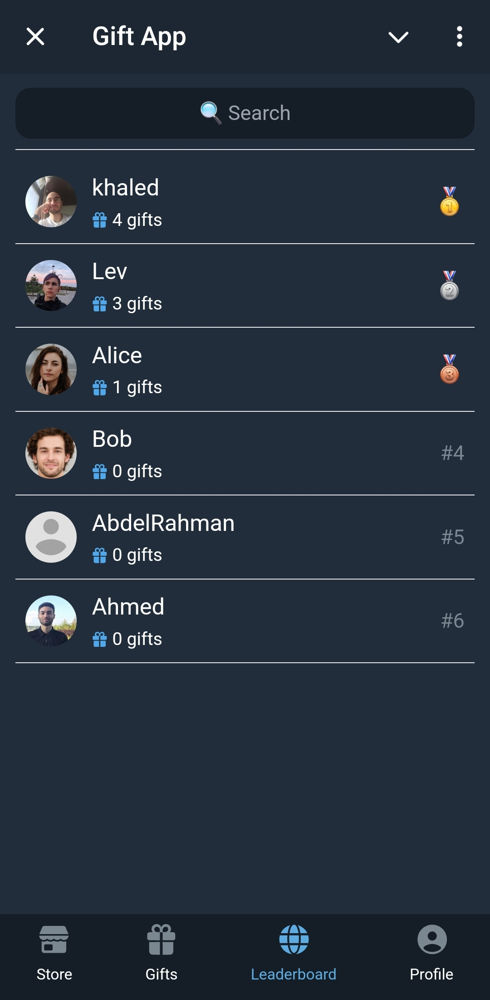 | 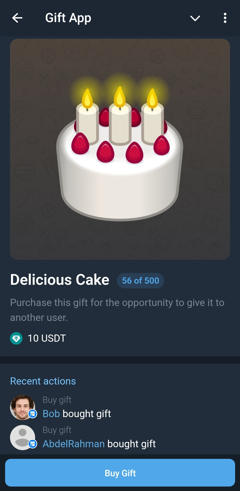 | 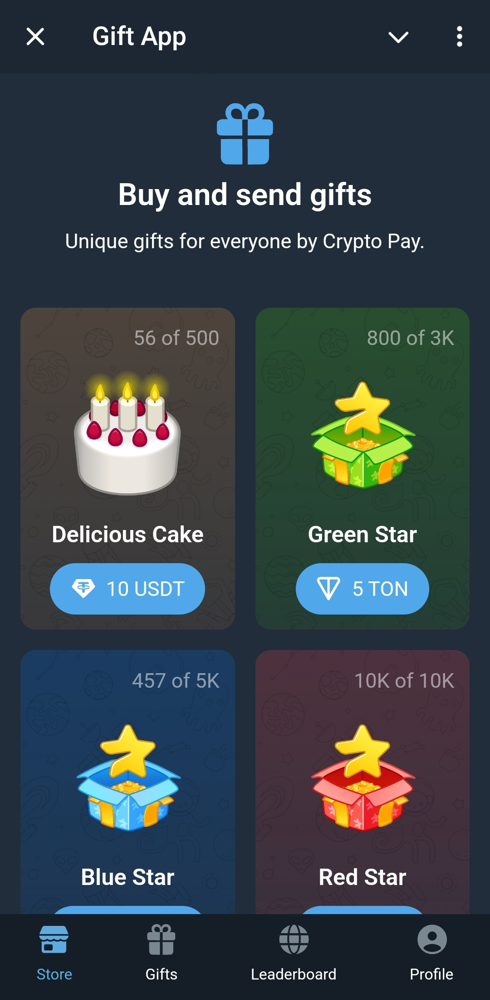 |

## Running

First, make sure to install dependencies:

```bash
pnpm install
```

Then, you can start the development server on `http://localhost:3000`:

```bash
pnpm dev
```

This will run the application in development mode with hot reloading.
However, you will need to set up a Telegram bot (using BotFather) and a MongoDB database to run the application.
After that, you can set the following environment variables:

```bash
NUXT_TELEGRAM_BOT_TOKEN=<token from bot father>
NUXT_TELEGRAM_API_SECRET=<password set in webhook secret_token param>
MONGODB_URI=mongodb+srv://<username>:<password>@<project>.mongodb.net/?retryWrites=true
```

## Directory Structure

Since this is a Nuxt project (even with SSR turned off), the server and client code are mixed together.
The frontend is found in the [`app`](./app) directory, while the backend is found in the [`server`](./server) directory.
They are both served by the same server, which is started by Nuxt.

Additionally, the translations can be found in the [`i18n/locales`](./i18n/locales) folder.
